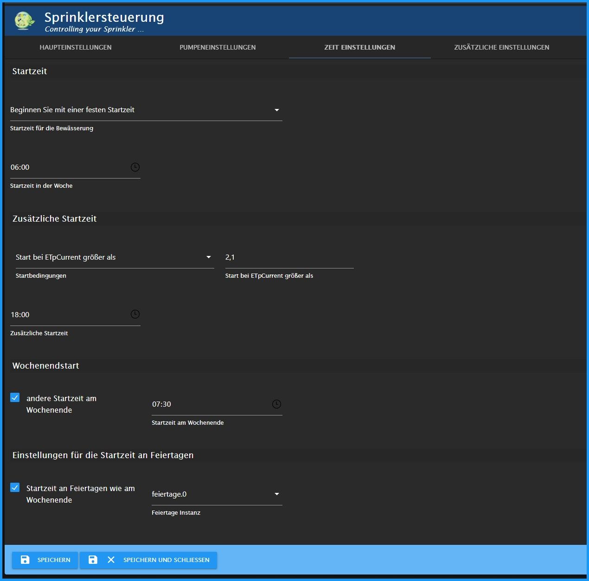
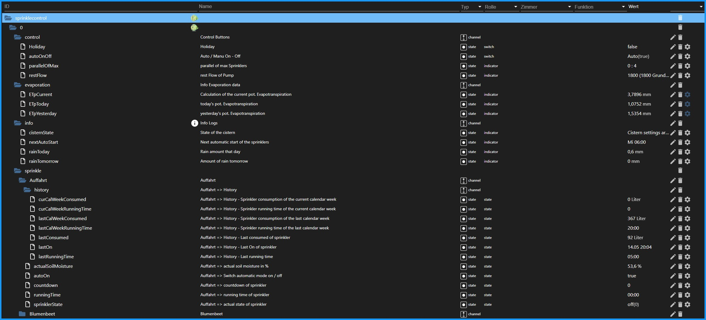

## Sprinklercontrol ist ein Adapter zur automatischen Steuerung der Gartenbewässerung.
# Grundlegendes

In Sprinklecontroll werden die Umweltdaten (Temperatur, Luftfeuchtigkeit, Helligkeit, Windgeschwindigkeit, Regenmenge) ausgewertet.
Die so ermittelte Verdunstung dient der Ermittlung der theoretischen Bodenfeuchte, der einzelnen Bewässerungskreise.
Zu einer unter "Zeit-Einstellungen" festgelegten Zeit, werden die Bewässerungskreise aktiviert die einen festgelegten prozentualen Wert unterschreiten.
Diese verschiedenen Bewässerungskreise werden dann so angesteuert, das die max. Pumpenleistung (l/h) und die max. Anzahl der Bewässerungskreise nicht überschritten wird.
Beides ist individuell anpassbar.

**Beispiel eines Schaltverhaltens an einem Tag (Startzeit aller Ventile: 6:00)**      

Meine Bewässerung arbeitet mit dem Homematic IP Wettersensor plus (HmIP-SWO-PL) und wurde nur mit diesem getestet.

## Installation
Der Adapter befindet sich auf GitHub (https://github.com/Dirk-Peter-md/ioBroker.sprinklecontrol). Von hier kann er heruntergeladen werden. 
Um ihn installieren zu können muss man in den Adapter von ioBroker gehen und dort "Installieren aus eigener URL" anklicken. 
Unter beliebig kann dann der URL Pfad (https://github.com/Dirk-Peter-md/ioBroker.sprinklecontrol) eingegeben werden.

Spätestens nach Refresh der Adapterliste steht der Adapter **Sprinklecontrol** zur Verfügung.

Nach anklicken des (+) wird eine Instanz angelegt und die notwendigen Daten des Adapters vom Repository geladen:

# Konfiguration - Haupteinstellungen
Sollte in dem Installationsfenster die Checkbox "***schließen wenn fertig***" nicht angehakt sein muss man dieses natürlich noch schließen.

Das Konfigurationsfenster besteht aus drei Reitern:
* Haupteinstellungen
* Pumpeneinstellungen
* Zeit-Einstellungen
* Extra-Einstellungen

Das Konfigurationsfenster öffnet sich automatisch mit den Haupteinstellungen

Auf dieser Seite ist eine Beispiel-ID abgelegt.
Diese bitte löschen und anschließend die eigenen IDs durch anklicken des (+) links oben über der Tabelle die eigenen Sprinkleraktoren hinzufügen.

Dabei bitte die Datenpunkte mit STATE (o.ä.) auswählen. NICHT das Gerät als solches.

Nach Abschluß der ID-Auswahl ist der Adapter bereits betriebsbereit, aber noch nicht an die eigenen Wünsche angepasst.

### Aufbau der Tabelle

**Nr:** - fortlaufende Nummer der gelisteten Bewässerungskreise

**Aktiv:** - Checkbox zur Aktivierung der Steuerung des entsprechenden Bewässerungskreises

**Name:** - Name des Aktors; wird bei der Auswahl der ID automatisch aus den Objekten eingelesen. Dieser Name des Aktors kann individuell angepasst werden. Es dürfen aber keine Duplikate vorkommen.

**Objekt-ID-Sprinkler:** - Eindeutige ID des zu steuernden Datenpunkts in den Objekten

**(+):** - Hinzufügen/Ändern der ID

**Bleistift:** - spezifische Konfiguration des jeweiligen Rollladens

**Pfeile:** - verändern der Reihenfolge der verschiedenen Rollläden

**Mülleimer:** - Löschen der ID mit allen Konfigurierten Daten!

## individuelle Konfiguration eines Bewässerungskreises
Auch diese Konfigurationsebene besteht aus zwei Reitern: **Haupteinstellungen** und **Pumpeneinstellungen**

---

### Haupteinstellungen

* **Bewässerungsdauer:** - Einstellung der Zeit zum Bewässern (diese wird verlängert je weiter der Trigger "niedrigster Prozentsatz der Bodenfeuchte" unterschritten wurde) 
* **maximale Bewässerungsverlängerung in %:** - Begrenzung der Bewässerungsdauer in Prozent (100 % = Bewässerungsdauer wird nicht verlängert )
* **Bewässerungsintervall:** - Die Bewässerungsdauer wird in einem Intervall aufgeteilt. (z.B. 5 min an, 5 min aus, 5 min an, usw.)
    * **Tipp:** - Bei mir habe ich ein Rasengitter bei der Autoauffahrt. Hier läuft das Wasser beim Bewässern einfach nur die Schräge herunter. Durch die Bewässerung in Intervallen konnte ich dem entgegenwirken. 
* **niedrigster Prozentsatz der Bodenfeuchte:** - Auslösetrigger: Wenn dieser Wert unterschritten wird, so beginnt zum Startzeitpunkt die Bewässerung.
* **Bedenfeuchte = 100 % nach der Bewässerung:** - Bei Aktivierung, wird die Bodenfeuchte nach der Bewässerung auf 100 % gesetzt. Ansonsten bleibt sie knapp darunter Aufgrund der Verdunstung während der Bewässerung.
* **maximale Bewässerung nach der Bewässerung:** - Max. Wassergehalt im Boden nach der Bewässerung.
    * **Tipp:** - Rasengitter: 5; Blumenbeet: 10; Rasenfläche: 14
* **maximale Bodenfeuchte nach einem Regen:** - Max. Wassergehalt im Boden nach einem kräftigen Regen.
    * **Tipp** - Rasengitter: 6; Blumenbeet: 15; Rasenfläche: 19
    
---

### Pumpeneinstellungen

* **Durchflussmenge:** - Ermittelte Durchflussmenge des aktuellen Bewässerungskreises.
    * **Tipp:** - Steht oft in der Bedienungsanleitung bzw. im Internet.
* **Booster:** - Nimmt alle aktiven Bewässerungskreise für 30 s vom Netz und schaltet sie danach wieder zu. 
    * **Tipp:** - Meine Pumpe liefert max. 1800 l/h und meine Rasenspränger benötigen 1400 l/h, aber den vollen Druck zum herausfahren. Mit der Boosterfunktion kann ich nebenbei noch die Koniferen bewässern die nur 300 l/h benötigen. 
    * **Achtung:** - Mit dieser Funktion sollte man sehr sparsam umgehen, da immer nur ein Bewässerungskreis mit aktiven Booster bewässern kann.    

---
---

# Konfiguration - Pumpen-Einstellungen
Hier werden die Einstellung der Hauptpumpe und der Spannungsversorgung der Regelkreise vorgenommen.

* **Einstellung der Ventile**

    * **Steuerspannung der Ventile:** - Durch anklicken des (+) Symbols öffnet sich das Select-ID State Fenster. Hier können sie das STATE für die Steuerspannung der Ventile auswählen.
    Dieser Ausgang ist aktive, so wie ein Ventil aktive ist.
    * **Maximaler Parallelbetrieb der Ventile** - Hier kann die Anzahl der aktiven Ventile begrenzt werden. Z.B. wenn der Steuertrafo nicht ausreicht, mehrere Ventile parallel zu schalten. 
    
* **Einstellung der Pumpe:**
    * **Hauptpumpe:** - Durch anklicken des (+) Symbols öffnet sich das Select-ID State Fenster. Hier wird das STATE der Pumpe hinterlegt, welche für die Wasserversorgung zuständig ist.
    * **maximale Pumpenleistung der Hauptpumpe in  l/h:** - Hier wird die maximale Pumpenleistung hinterlegt. Diese begrenzt dann die Bewässerungskreise, damit noch genügend Druck an den Ventilen ansteht.
        * **Achtung:** - Hier muss die tatsächliche Pumpenleistung angegeben werden, nicht die vom Typenschild. Ich habe z.B. eine "Gardena 5000/5 LCD" diese schafft aber nur 1800l auf grund der Leitungslänge und nicht 4500l/h, wie auf dem Typenschild angegeben.  

* **Zisternenpumpe als Prioritätspumpe hinzufügen:** - (noch nicht programmiert, aber in Planung)
    * **Zisternenpumpe:** - (noch nicht programmiert, aber in Planung)
    * **maximale Pumpenleistung der Zisterne in l / h** - (noch nicht programmiert, aber in Planung)
    * **Höhe der Zisterne** - (noch nicht programmiert, aber in Planung)
    * **Mindestfüllstand der Zysten in%** - (noch nicht programmiert, aber in Planung)

---
---

# Konfiguration - Zeit-Einstellungen
In diesem Abschnitt wird die Startzeiten von Sprinklecontrol festgelegt.

## Startzeit für die Bewässerung

* **Beginnen Sie mit einer festen Startzeit:** Bei dieser Auswahl startet die Bewässerung zu einer festgelegten, unter "Startzeit in der Woche" festgelegten Zeit.
    * **Startzeit in der Woch:** - angabe der Startzeit in der Woche.
* **Startzeit bei Sonnenaufgang:** - Wenn sie diese Option auswählen, so startet die Bewässerung bei Sonnenaufgang. Diese Zeit kann aber noch unter Zeitverschiebung variiert werden.
    * **Zeitverschiebung:** - Eingabe der Zeitverschiebung bei Sonnenaufgang. (+/- 120 min)
* **Startzeit am Ende der goldenen Stunde:** - Hier startet die Bewässerung zum Ende der Golden Hour.

---
* **andere Startzeit am Wochenende:** - Soll die Bewässerung am Wochenende zu einer anderen Zeit starten (um z.B. den Nachbarn nicht zu verärgern), so kann man es hier aktivieren.
    * **Startzeit am Wochenende:** - Startzeit für das Wochenende.
    * **Startzeit der Feiertage wie am Wochenende:** - Wenn an Feiertagen auch wie am Wochenende die Bewässerung starten soll, so kann es hier aktiviert werden.
        * **Feiertage Instanz:** - Hier muss dann aber noch die externe Feiertagsinstanz ausgewählt werden. (z.B. der Adapter "Deutsche Feiertage")

---
---

# Konfiguration - Zusätzliche-Einstellungen

In den Extra-Einstellungen werden verschiedene Einstellungen eingegeben, die bei der Berechnung der Verdunstung unerlässlich sind.

## Astro-Einstellungen
Diese Einstellungen sind eigentlich selbsterklärend: Breiten- und Längengrad des Wohnorts um den Sonnenstand korrekt berechnen zu können.

* **Breitengrad:** - Hier kann ein Offset eingegeben werden um den sich die Rollladenfahrten für hoch bzw. runter von den später ausgewählten Astro-Events verschieben soll.

* **Längengrad** - Damit nicht alle Rollläden gleichzeitig fahren, kann hier eine Zeit in Sekunden für eine Verzögerung eingestellt werden.

## Debug-Einstellungen

* **debuggen:** Durch Aktivierung werden im Log zusätzliche Informationen angezeigt, wodurch Fehler schneller ermittelt werden können.

## Verdunstungsberechnungssensoren

Über die Sensoren wird die max. mögliche Verdunstung der pot. Evapotranspiration nach Penman ETp berechnet und zur Steuerung der Bewässerungsanlage genutzt.
Dies geschieht jedes Mal, wenn die Temperatur sich ändert.
* **Temperatursensor:** - Durch anklicken des (+) Symbols öffnet sich das Select-ID State Fenster. Hier können sie das ID des Luftsensor in °C auswählen.
* **Feuchtigkeitssensor:** - Durch anklicken des (+) Symbols öffnet sich das Select-ID State Fenster. Hier können sie das ID des Feuchtigkeitssensor in % auswählen.
* **Windgeschwindigkeitssensor:** - Durch anklicken des (+) Symbols öffnet sich das Select-ID State Fenster. Hier können sie das ID des Windgeschwindigkeitssensor in km/h auswählen.
* **Helligkeitssensor:** - Durch anklicken des (+) Symbols öffnet sich das Select-ID State Fenster. Hier können sie das ID des Helligkeitssensor auswählen.
* **Regensensor:** - Durch anklicken des (+) Symbols öffnet sich das Select-ID State Fenster. Hier können sie das ID des Regensensor in mm auswählen.

***

# Objekte

## control
* **Holiday** - Wenn Holiday auf true gesetzt wird, so wird die Bewässerung zu der Zeit gestartet wie am Wochenende. Falls die Wochenendeinstellung aktiviert wurde. Die Verbindung mit einem Kalender wäre hier auch möglich.
* **autoOnOff** - Bei Einstellung "off" ist der Automatikbetrieb der Bewässerungsanlage deaktiviert.
* **parallelOfMax** - z.B. (3 : 4) Drei Bewässerungskreise sind von vier möglichen aktive. (Dies ist nur eine Anzeige!)
* **restFlow** - Anzeige der noch möglichen Restfördermenge der Pumpe.  (Dies ist nur eine Anzeige!)

## evaporation
Ich habe mich zur Berechnung der Verdunstung nach der Formel für die Berechnung der mittleren monatlichen Verdunstung nach Penman gerichtet. Dies ist für mich ausreichend, obwohl sie nicht zu 100 % umgesetzt wurde.
* **ETpCurrent** - Dies ist dei aktuelle Verdunstung als Tageswert. 
* **ETpToday** - Hier wird die aktuelle Tagesverdunstung angezeigt. Diese wird in der Nacht um 0:05 zur ETpYesterday verschoben und dann wieder auf 0 gesetzt.
* **ETpYesterday** - ist die Anzeige der Verdunstung des gestrigen Tages.
## info
* **nextAutoStart** - Anzeige des nächsten Starts der Bewässerungsanlage.
## sprinkle
* **Auffahrt** - Ort des Geschehens (wurde in der Config unter Haupteinstellung => Name so individuell benannt)
    * **history**
        * **curCalWeekConsumed** - aktueller wöchentlicher Verbrauch in Liter des Beregnungskreises
        * **curCalWeekRunningTime** - aktuelle wöchentliche Gesamtlaufzeit des Beregnungskreises
        * **lastCalWeekConsumed** - letzter wöchentlicher Verbrauch in Liter des Beregnungskreises
        * **lastCalWeekRunningTime** - letzte wöchentliche Gesamtlaufzeit des Beregnungskreises
        * **lastConsumed** - Wasserverbrauch bei der letzten Bewässerung in Liter
        * **lastOn** - letzter Start des Beregnungskreises (05.07 14:14)
        * **lastRunningTime** - letzte Bewässerungsdauer
    * **actualSoilMoisture** - aktuelle virtuelle Bodenfeuchte in % (max. 100 % nach der Beregnung, >100 % nach einem kräftigen Regen) (hat mit der tatsächlichen nichts zu tun)
    * **countdown** - Restzeit des Beregnungskreises
    * **runningTime** - Laufzeit des Beregnungskreises
        - wenn hier eine Zahl > 0 eingegeben wird, so startet der Beregnungskreises für die angegebene Zeit in Minuten
        - bei eingabe einer 0 wird die Bewässerung des Beregnungskreises beendet 
                         
    * **sprinklerState** - Anzeige des Zustandes des Beregnungskreises
        - 0:off;    => Beregnungskreis aus
        - 1:wait;   => Beregnungskreis wartet auf eine freiwerdende Kapazität der Pumpe
        - 2:on;     => Beregnungskreis ein
        - 3:break;  => Beregnungskreis wurde unterbrochen (Configuration, Intervallberegnung)
        - 4:Boost;  => Boostfunktion des aktuellen Beregnungskreises ist aktiv (Configuration, Booster ein)
        - 5:off(Boost) => Beregnungskreis für 30 s unterbrochen, da eine Boostfunktion aktive ist
# Was ist für die Zukunft geplant
* **Restfehler beseitigen (ESLint)**
* **Steuerung einer 2. Wasserquelle hinzufügen mit automatischer Umschaltung, wenn Zisterne leer wird**
